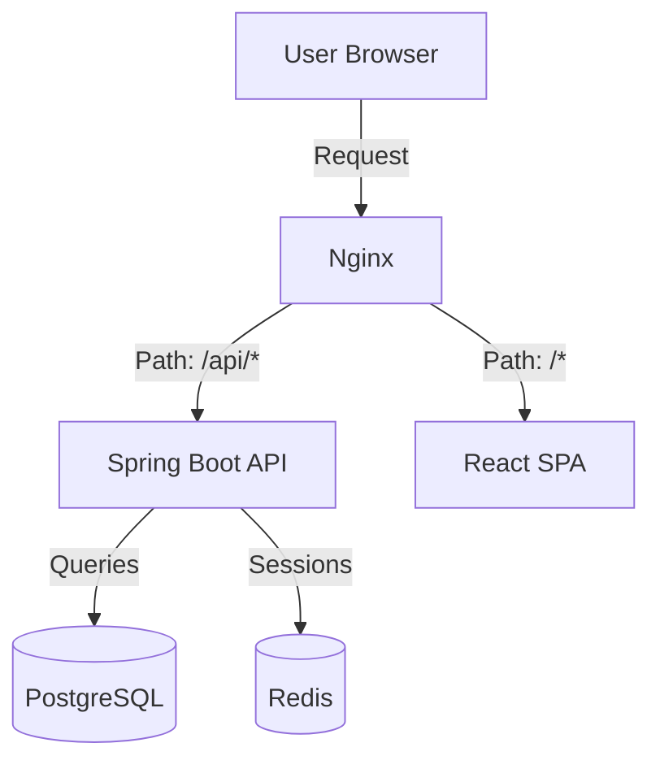

# WorkoutTracker
A locally hosted, full-stack, self-hosted workout tracker for logging and analyzing your training. You can track your workouts and see your progress over time with one rep max visualisations.

## Features
- **Workout Logging**: Record your workouts exercises, sets and repetitions with 400 exercises to choose from.
- **Exercise Tracking**: Visualise your progress across weeks to months with average and peak one rep max calculations for any exercise.
- **Secure Authentication**: WorkoutTracker has an account system with JWT based authentication and refresh token support to keep you logged in securely.
- **Privacy Focused**: WorkoutTracker does not collect or send any uncessary data to first or third parties.


## Tech Stack
### Frontend
- **React with Typescript**
- **Tailwind CSS**
- **Designed with [Shadcn](https://ui.shadcn.com/)**

### Backend
- **SpringBoot**
- **PostgreSQL** - Primary Database for storing user and workout information.
- **Redis** - Session management/Refresh system.
### DevOps
- **Docker/Docker Compose**
- **Hosted frontend with Nginx** - Common entrypoint into Docker network.

## Architecture



## 🚨🚨 Important 🚨🚨 
- **WorkoutTracker is designed to be used in a *local, trusted network*. It currently does **NOT** support native HTTPS.**
- To use WorkoutTracker remotely from its hosted network it is **HIGHLY** recommended to use a secure proxy or VPN like CloudFlare Tunnel or OpenVPN.**
- **DO NOT** port forward this application.

## Getting Started (Linux)
### Prerequisites
- Docker
- Docker Compose

### Steps
1. Clone the repository:
```bash
git clone https://github.com/JanOkul/WorkoutTracker.git
cd WorkoutTracker
```

2. Create a `.env` file in the root directory with the following variables:
```env
POSTGRES_DB=[Same value as DB_NAME (RECOMMENDED: workout-db)]
DB_PORT=5432
POSTGRES_USER=[Postgres admin name (RECOMMENDED: admin)]
POSTGRES_PASS=[Secure password for postgres admin]
SERVER_USER=[Postgres user for SpringBoot server (RECOMMENDED: spring-server)]
SERVER_PASS=[Postgres password for SpringBoot server]
REDIS_PORT=6379
```

3. Build and start the application:
```bash
docker compose up -d --build
```

4. Access the website at:
```
http://localhost:80
```

### Refresh Signing Key
If the JWT signing key is ever leaked, or exposed. You can refresh the key by removing the key file and restarting the server.

```bash
docker compose exec backend rm /app/data/signingKey.key
docker compose down
docker compose up -d
```
